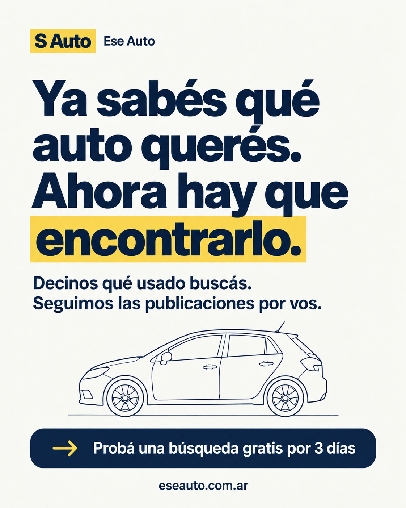
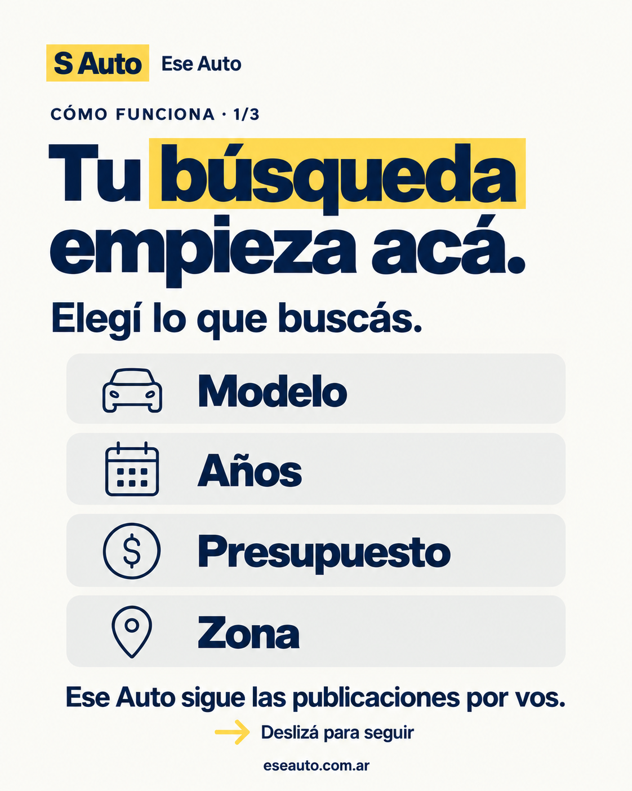
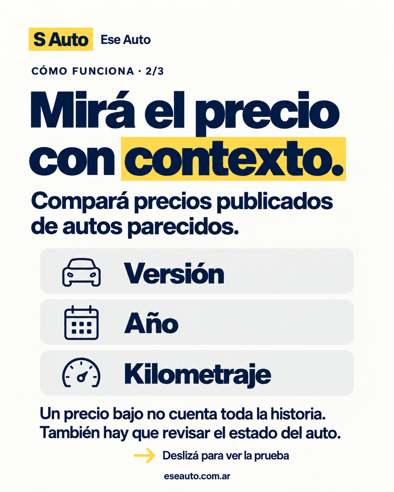
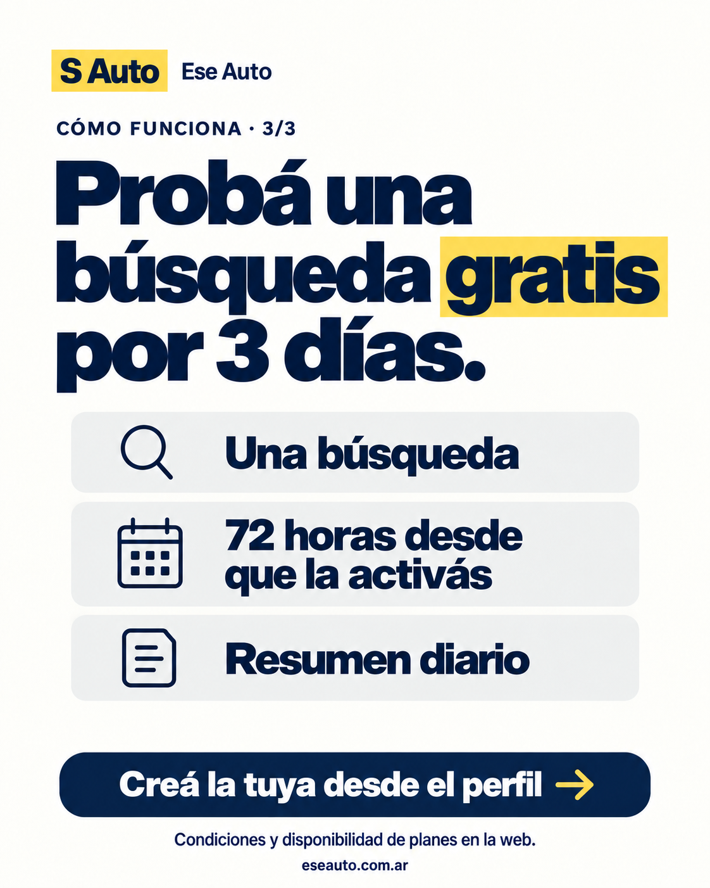
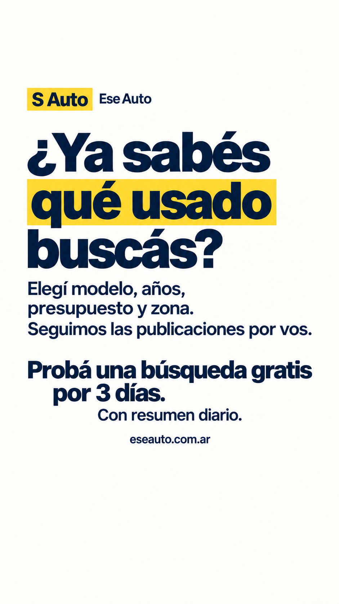
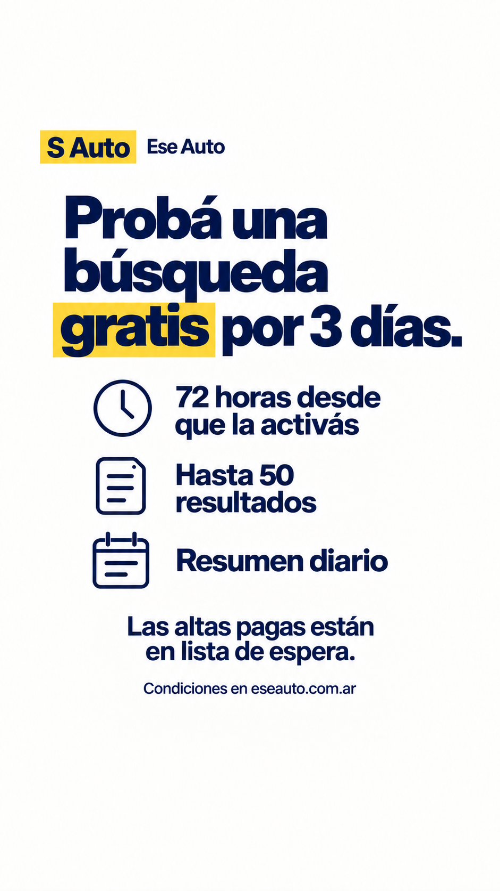
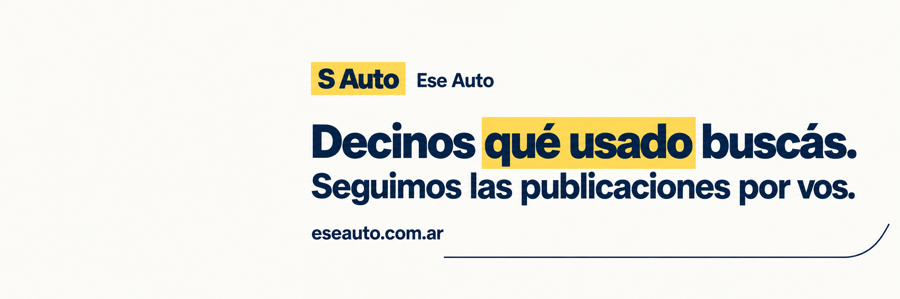

# Ese Auto: lanzamiento del 5 y 6 de octubre

Primeras 48 horas · Horarios de Argentina · Preparado el 4 de octubre de 2026

**La decisión:** Instagram y X de Ese Auto explican el producto; Juan hace una presentación personal el lunes. El martes profundizamos desde la marca. El objetivo es conseguir primeras búsquedas pertinentes y preguntas útiles para mejorar el servicio. Todavía no se publicó ni programó contenido ni se activaron anuncios.

Esta guía continúa la [estrategia de 30 días](../ESTRATEGIA_LANZAMIENTO_2026-10-03.md). Como las capturas muestran cuentas de marca sin publicaciones y se empieza mañana, concentramos la presentación y las condiciones el lunes, y la explicación del uso el martes. Es una adaptación del calendario: P01 y P03 el lunes, P04 después de preparar los perfiles, P02 el martes. La segunda intervención personal continúa prevista a mitad del mes.

## 1 Qué buscamos en estos dos días

El público inicial es quien ya tiene modelo, presupuesto y zona en mente y está buscando comprar un usado. El mensaje principal es **«Decinos qué usado buscás. Seguimos las publicaciones por vos»**. La prueba sirve para comprobar relevancia, no para prometer que en tres días se encontrará un auto.

La secuencia tiene tres funciones: que se entienda la propuesta, que se conozcan las condiciones y que haya una primera acción concreta. El carrusel del martes explica el recorrido; es una guía conceptual, no una captura del producto ni evidencia de resultados obtenidos. La próxima pieza que conviene producir es una búsqueda real con filtros y resultados verificados, ocultando datos personales.

Mantenemos la línea para profesionales del plan original, pero estas primeras piezas hablan al comprador particular. Después se prepara una demostración separada para quienes buscan vehículos habitualmente.

**Inversión de Meta Ads en estas 48 horas: $0.** La cuenta publicitaria ya existe según lo que informó Juan. La primera prueba paga sigue en la etapa prevista del plan, después de comprobar el recorrido y la utilidad de los resultados, y definir un tope de gasto. Conectar Instagram a Ads Manager no comprueba que la campaña o su medición estén listas.

## 2 Qué cambiar de los perfiles

Revisión basada en las tres capturas enviadas. Estas recomendaciones no se aplicaron a las cuentas.

### Instagram · @eseauto.ar

- **Mantener el usuario.** Es corto, fácil de recordar y coherente con el dominio.
- Cambiar el nombre visible a **Ese Auto | Buscador de usados**. Aclara qué ofrece la cuenta a quien llega por primera vez; no es una garantía de posicionamiento.
- Conservar las dos primeras líneas de la bio y cambiar la última a **«Probá una búsqueda gratis por 3 días ↓»**, para usar el mensaje elegido por Juan.
- Mantener un único enlace a la web. Si el enlace actual usa otra campaña, se puede reemplazar por el enlace de perfil incluido más abajo para agrupar el lanzamiento.
- Comprobar desde otra cuenta que el contacto público muestre **contacto@eseauto.com.ar**. La captura no permite confirmar ese botón. Usar cuenta profesional de empresa si todavía no lo es y una categoría disponible como «Producto/servicio»; su visibilidad es opcional.
- Crear el destacado **Prueba** con la historia 06 del paquete, y **Cómo funciona** después del carrusel del martes. Un destacado **Ayuda** puede contener una historia nativa con el correo y las preguntas frecuentes cuando haya consultas reales.
- Fijar el post del lunes y el carrusel del martes. La tercera posición puede reservarse para una demostración real; no hace falta rellenarla antes de tener evidencia.
- Mantener el avatar durante estos dos días. Se lee S Auto, igual que la marca de la web. En los artes lo acompañamos con «Ese Auto» para explicar la relación. Después conviene acordar un único tratamiento del nombre en web, avatar y materiales. No cambiar el logo de una sola cuenta por separado.
- El aviso «Agrega el número de teléfono» pertenece a la configuración de tu cuenta, no al contenido del perfil público. No hace falta publicar tu teléfono personal para este lanzamiento.

**Bio recomendada con el mensaje elegido:**

> Decinos qué usado buscás.
> Seguimos publicaciones y comparamos precios.
> Probá una búsqueda gratis por 3 días ↓

### X de marca · @eseautoar

- Mantener nombre **Ese Auto** y usuario. Cambiar la frase final de la bio a **«Probá una búsqueda gratis por 3 días. Argentina.»** Las mayúsculas del usuario que aparecen en la captura no requieren otra cuenta.
- Cargar el **encabezado 07** de este paquete. Revisar la vista móvil para que el avatar no tape texto.
- Completar **Sitio web** con el enlace de perfil de X y **Ubicación** con «Argentina». En la captura no se ve el enlace de la web.
- Publicar y fijar el post de presentación del lunes. Agregar las condiciones como respuesta propia al mismo post.
- Responder y dar soporte como Ese Auto. El correo comercial puede quedar en la respuesta de ayuda cuando haga falta; no cargar datos personales de Juan.
- No hace falta contratar verificación para este arranque. La tarjeta de verificación y los recordatorios de configuración que ves como dueño no son publicaciones de la marca.

### X personal · @JuanCapurro12

**Mantendría «Colo», tu foto y el encabezado de Boca.** La antigüedad de la cuenta aporta contexto humano; sus 236 seguidores visibles no son evidencia de una audiencia compradora de autos. El lanzamiento debe sonar a vos y pedir una prueba útil, sin convertir el perfil en una empresa.

Publicá un solo post del proyecto el lunes. El martes respondé si hay consultas y mantené tu uso habitual. La siguiente publicación comercial personal se reserva para una novedad concreta o para la intervención de mitad del mes del plan. El texto no necesita foto tuya ni video con tu cara.

La bio personal puede quedar como está. Si querés vincular el proyecto de manera permanente, la línea opcional es «Estoy creando @eseautoar». No es necesaria para publicar. Revisá únicamente si hay información personal que ya no quieras dejar visible; no hace falta borrar el historial de fútbol ni cambiar tu identidad.

Asociar públicamente tu cuenta con la marca hace visible que el proyecto es tuyo. Limitamos la exposición cotidiana llevando las consultas a @eseautoar y al correo comercial, sin teléfono personal ni mensajes privados masivos.

## 3 Calendario concreto

Los horarios permiten atender y preparar los perfiles antes del anuncio personal. Son una hipótesis operativa, no horarios probados para estas cuentas. Si no podés estar disponible después de las 12:30, mové la presentación personal a una hora en la que sí puedas responder.

| Día y hora | Desde dónde | Acción | Archivo / texto |
|---|---|---|---|
| Lunes 5 · 08:30 | Perfiles de marca | Cargar encabezado de X, revisar enlaces y contacto | 07 y sección 2 |
| Lunes 5 · 09:00 | Instagram @eseauto.ar | Publicar la presentación y fijarla | 01 + copy IG lunes |
| Lunes 5 · 09:15 | X @eseautoar | Publicar presentación, fijar y responder con condiciones | Copy X lunes + respuesta |
| Lunes 5 · 09:30 | Instagram @eseauto.ar | Historia de presentación con enlace real | 05 |
| Lunes 5 · 09:35 | Instagram @eseauto.ar | Historia de condiciones con enlace; guardar en Prueba | 06 |
| Lunes 5 · 12:30 | X personal @JuanCapurro12 | Un post de presentación con su propio enlace | Copy personal lunes |
| Lunes 5 · 19:30 | Cuentas de marca | Responder consultas y registrar preguntas | Rutina de crecimiento |
| Martes 6 · 12:30 | Cuentas de marca | Revisar consultas y posibles obstáculos del registro | Respuestas a casos reales |
| Martes 6 · 19:30 | Instagram @eseauto.ar | Publicar el carrusel en orden y fijarlo | 02 → 03 → 04 + copy IG martes |
| Martes 6 · 19:45 | X @eseautoar | Publicar explicación breve | Copy X martes, solo texto |
| Martes 6 · 20:00 | Instagram @eseauto.ar | Compartir el carrusel a historias desde Instagram | Publicación nativa |
| Martes 6 · 20:10 | Instagram @eseauto.ar | Historia de prueba con nuevo enlace del día | Reutilizar 06 |
| Martes 6 · 20:15 | Instagram @eseauto.ar | Encuesta nativa breve, si podés atender respuestas | «¿Qué te cuesta más al buscar un usado?» |

Para la encuesta: opciones **«Encontrar opciones»** y **«Comparar precios»**. Fondo azul, letras claras y sticker de encuesta de Instagram. Es una pieza nativa sencilla; no hay que diseñar otro archivo. Sus respuestas orientan el próximo contenido, no representan a todo el mercado.

Si ya hay una página de Facebook de Ese Auto configurada, replicar las piezas del feed a las 09:05 del lunes y 19:35 del martes con la adaptación de copy y enlaces de abajo. Si falta la página, el lanzamiento de estas tres cuentas puede continuar sin esa tarea adicional.

## 4 Textos listos para publicar

### Instagram · lunes 5 · presentación

**Imagen:** 01-lunes-presentacion-feed-v2.png. Publicar como foto del feed, conservar el encuadre completo y fijar. Un único llamado a la acción: el enlace del perfil. No agregar hashtags genéricos ni etiquetar cuentas que no participaron.

> Si estás buscando un usado, quizá ya sabés qué modelo querés, cuánto podés gastar y hasta dónde irías a verlo.
>
> En Ese Auto configurás esa búsqueda y seguimos las publicaciones por vos. También comparamos precios publicados de autos parecidos para que puedas mirar cada opción con más contexto.
>
> Probá una búsqueda gratis por 3 días y con resumen diario. Las 72 horas empiezan cuando la activás.
>
> Estamos en lanzamiento: las altas pagas siguen en lista de espera.
>
> Creá tu búsqueda desde el enlace del perfil.

**Texto alternativo para la imagen:**

> Placa de Ese Auto en azul y amarillo. Dice: «Ya sabés qué auto querés. Ahora hay que encontrarlo». Explica que sigue publicaciones de usados y permite probar una búsqueda tres días gratis. Incluye un dibujo decorativo de un auto y el dominio eseauto.com.ar.

### X de marca · lunes 5 · presentación fijada

**Formato:** solo texto con enlace. La imagen del feed queda para Instagram; en X buscamos una entrada breve y una explicación fijada fácil de consultar.

> Ya sabés qué auto querés. Ahora hay que encontrarlo.
>
> En Ese Auto elegís modelo, presupuesto y zona; seguimos las publicaciones por vos.
>
> Probá una búsqueda gratis por 3 días y con resumen diario.
>
> https://www.eseauto.com.ar/?utm_source=x&utm_medium=organic_social&utm_campaign=lanzamiento_20261005&utm_content=marca_d1

**Respuesta propia al post fijado, publicada inmediatamente:**

> La prueba incluye 1 búsqueda, hasta 50 resultados y resumen diario. Son 72 horas desde que la activás; pausarla no reinicia el plazo.
>
> Las altas pagas están en lista de espera. Al vencer, cesan nuevas coincidencias y alertas; conservás historial y favoritos.

### X personal · lunes 5 · presentación de Juan

**Formato:** un post de presentación y una respuesta propia con explicación, prueba y enlace. Publicar después de completar el contenido inicial de la marca. El post principal tiene 256 caracteres; la respuesta ocupa aproximadamente 232 en X, contando el enlace como 23.

**Post principal:**

> Buscando un auto terminé armando una herramienta para seguir publicaciones y comparar precios.
>
> La hice para mí y me ayudó a encontrar el auto que compré hace poco.
>
> Después la convertí en una web para que la pudiera usar cualquiera.
>
> Así nació @eseautoar.

**Respuesta propia:**

> Le decís qué usado buscás, presupuesto y zona. Sigue las publicaciones por vos y compara precios de autos parecidos.
>
> Probá una búsqueda gratis por 3 días. Si la usás, contame qué te sirvió y qué mejorarías.
>
> https://www.eseauto.com.ar/?utm_source=x&utm_medium=organic_social&utm_campaign=lanzamiento_20261005&utm_content=juan_d1

**Visual opcional:** adjuntar al primer post una captura real del producto que muestre una búsqueda y su comparación de precios. Usar resultados comprobados y ocultar datos personales. El relato puede publicarse solo con texto si esa captura todavía no está lista.

La historia se apoya en lo que Juan confirmó el 5 de octubre: hizo la herramienta para buscar su propio auto, le ayudó a encontrar el que compró y después la llevó a una plataforma pública. No añadir modelo, precio, tiempo ahorrado ni una anécdota específica de la búsqueda sin confirmación.

Si te consultan por soporte, podés contestar desde tu voz personal y luego derivar: «Escribile a @eseautoar así lo vemos desde la cuenta del proyecto». No hace falta responder cada interacción con otra promoción.

### Instagram · martes 6 · cómo funciona

**Formato:** carrusel de tres imágenes. Seleccionar 02, 03 y 04 en ese orden. Es una guía visual del uso; no afirmar que estas placas muestran resultados reales.

> Así empieza tu búsqueda en Ese Auto:
>
> 1. Elegís modelo, años, presupuesto y zona.
> 2. Revisás las coincidencias y mirás su precio frente a autos parecidos.
> 3. Durante la prueba, recibís un resumen diario.
>
> Un precio bajo no cuenta toda la historia: también hay que revisar el estado del auto y hablar con el vendedor.
>
> Probá una búsqueda gratis por 3 días. Incluye hasta 50 resultados y resumen diario. Las 72 horas empiezan cuando la activás.
>
> Las altas pagas están en lista de espera. Al vencer el acceso se detienen nuevas coincidencias y alertas; conservás historial y favoritos.
>
> Creá la tuya desde el enlace del perfil.

**Texto alternativo · imagen 02:**

> Primer paso de la guía de Ese Auto: elegir modelo, años, presupuesto y zona. La placa indica que Ese Auto sigue las publicaciones por vos.

**Texto alternativo · imagen 03:**

> Segundo paso: comparar precios publicados de autos parecidos considerando versión, año y kilometraje. Aclara que un precio bajo no cuenta toda la historia y hay que revisar el estado del auto.

**Texto alternativo · imagen 04:**

> Tercer paso: probar una búsqueda durante 72 horas desde su activación, con resumen diario y gratis. Invita a crearla desde el perfil y consultar condiciones y disponibilidad de planes en la web.

### X de marca · martes 6 · explicación

**Formato:** un post solo texto. No copiar el post personal ni volver a anunciar «hoy lanzamos».

> Modelo, años, presupuesto y zona: así empieza tu búsqueda en Ese Auto.
>
> Después revisás coincidencias y comparás precios publicados de autos parecidos.
>
> Probá una búsqueda gratis por 3 días, con resumen diario. Las 72 horas empiezan al activarla.
>
> https://www.eseauto.com.ar/?utm_source=x&utm_medium=organic_social&utm_campaign=lanzamiento_20261005&utm_content=marca_d2

### Facebook · adaptación si la página ya existe

Usar el copy de Instagram del día correspondiente y reemplazar únicamente la última frase por el cierre de abajo. Publicar desde la página Ese Auto, no desde el perfil personal.

**Cierre del lunes:**

> Creá tu búsqueda en https://www.eseauto.com.ar/?utm_source=facebook&utm_medium=organic_social&utm_campaign=lanzamiento_20261005&utm_content=feed_d1

**Cierre del martes:**

> Creá tu búsqueda en https://www.eseauto.com.ar/?utm_source=facebook&utm_medium=organic_social&utm_campaign=lanzamiento_20261005&utm_content=feed_d2

## 5 Archivos y cómo usarlos

Las imágenes finales están en la carpeta **imagenes**, con nombres que indican el orden. Son PNG listos para subir. Las placas del feed usan proporción 4:5, las historias 9:16 y el encabezado 3:1. No subir el encabezado como post. Usar los cuatro archivos con sufijo **v2** y los tres restantes indicados aquí. Los bocetos anteriores quedan fuera de la selección; el ZIP V2 contiene únicamente las siete imágenes elegidas.

| Archivo | Uso | Acción al subir |
|---|---|---|
| [01 · presentación](imagenes/01-lunes-presentacion-feed-v2.png) | Feed de Instagram del lunes; Facebook opcional | Mantener imagen completa, agregar copy y texto alternativo |
| [02 · carrusel 1](imagenes/02-martes-carrusel-1.png) | Portada del carrusel del martes | Primera imagen |
| [03 · carrusel 2](imagenes/03-martes-carrusel-2.png) | Comparación con contexto | Segunda imagen |
| [04 · carrusel 3](imagenes/04-martes-carrusel-3-v2.png) | Prueba y siguiente acción | Tercera imagen |
| [05 · historia presentación](imagenes/05-historia-presentacion-v2.png) | Historia del lunes | Agregar sticker real de enlace «Crear mi búsqueda» |
| [06 · historia prueba](imagenes/06-historia-prueba-v2.png) | Condiciones del lunes y recordatorio del martes | Agregar sticker de enlace «Ver la prueba»; guardar en destacado Prueba |
| [07 · encabezado X](imagenes/07-encabezado-x.png) | Perfil de @eseautoar | Revisar recorte móvil y superposición del avatar |

**Vista de las piezas:**

En las historias, poner el sticker de enlace en el espacio blanco debajo del último texto, dejando margen respecto de los controles inferiores. No tapar las condiciones. Revisar la vista previa antes de publicarlas. El dominio escrito en la imagen no funciona como enlace: hay que cargar el sticker real.

El lunes guardar 06 en **Prueba**. El martes compartir el carrusel a historias desde Instagram y guardarlo en **Cómo funciona**; este último destacado muestra una guía conceptual. Cuando haya una demostración del producto, incorporarla al mismo destacado.

**Plantilla editable en Canva:** [abrir y editar la placa principal](https://www.canva.com/d/LZI0mkml8f-sTzi). Se creó mediante conversión y se verificó que sus textos quedaron separados. Los PNG de esta carpeta son la selección para publicar; cualquier nueva exportación del editable debe revisarse antes de reemplazarlos.

## 6 Enlaces listos para cada origen

Usamos la misma campaña y cambiamos el origen y la pieza. Esto permite distinguir el anuncio personal de las cuentas de marca cuando la herramienta de medición registre esas visitas. Un enlace etiquetado por sí solo no comprueba que una búsqueda se haya activado. Copiar cada enlace completo.

### Perfil de Instagram

> https://www.eseauto.com.ar/?utm_source=instagram&utm_medium=organic_social&utm_campaign=lanzamiento_20261005&utm_content=bio

### Perfil de X de marca

> https://www.eseauto.com.ar/?utm_source=x&utm_medium=organic_social&utm_campaign=lanzamiento_20261005&utm_content=perfil_marca

### Historia de presentación del lunes · archivo 05

> https://www.eseauto.com.ar/?utm_source=instagram&utm_medium=organic_social&utm_campaign=lanzamiento_20261005&utm_content=historia_presentacion_d1

### Historia de prueba del lunes · archivo 06

> https://www.eseauto.com.ar/?utm_source=instagram&utm_medium=organic_social&utm_campaign=lanzamiento_20261005&utm_content=historia_prueba_d1

### Historia de prueba del martes · reutilizar archivo 06

> https://www.eseauto.com.ar/?utm_source=instagram&utm_medium=organic_social&utm_campaign=lanzamiento_20261005&utm_content=historia_prueba_d2

## 7 Cómo hacer crecer cada cuenta

Las cantidades propuestas son límites de trabajo y una cadencia sostenible, no promesas de alcance. El tiempo de responder a gente con intención de compra tiene prioridad sobre llenar un calendario.

### Instagram: crecer mostrando y resolviendo

Reservar **20 minutos por día**, divididos entre mediodía y noche. Contestar cada consulta pertinente, revisar menciones y anotar qué se entendió mal. Antes de buscar más alcance, mantener claros el perfil, los dos posts fijados, los destacados y el enlace.

Después de estos dos días, apuntar a **tres publicaciones por semana**: una demostración real, una explicación útil para comparar usados y una respuesta a una pregunta frecuente. Publicar dos o tres historias en días con algo que mostrar. No hace falta publicar a diario. Una demostración en video puede mostrar solo pantalla y subtítulos cuando esté comprobado el recorrido; la cara de Juan es opcional.

Buscar cuentas argentinas relacionadas con compra de usados, inspecciones y consejos de mecánica. Participar cuando haya una pregunta a la que podamos aportar una respuesta específica. Dos comentarios útiles son mejores que dejar publicidad en muchas cuentas. El enlace se comparte cuando sea pertinente o solicitado, no como cierre automático.

Para una colaboración posterior, elegir a alguien cuya audiencia esté buscando comprar, permitirle probar y acordar una demostración honesta. Todavía no enviar invitaciones ni prometer resultados. Usar los contenidos que generen preguntas, guardados y visitas pertinentes para decidir qué producir después. Consultar las recomendaciones personalizadas del panel profesional cuando esté disponible: [Best Practices de Instagram](https://about.fb.com/news/2024/10/best-practices-education-hub-creators-instagram/).

**Medir por semana:** visitas al perfil, clics al sitio, consultas con intención de compra, búsquedas activadas y guardados/compartidos del contenido útil. Los seguidores son un dato secundario.

### X de Ese Auto: crecer conversando con compradores

Reservar **15 minutos por día**. Crear una lista privada de fuentes y conversaciones relevantes: periodistas de autos, especialistas en inspecciones, compradores que hacen preguntas y profesionales del rubro. Seguir por interés real; no hace falta completar una cuota para que la cuenta parezca activa.

Buscar manualmente conversaciones recientes con frases como «busco un usado», «comprar mi primer auto» o modelos que el producto cubra bien. Responder solo cuando podamos ayudar. Como referencia de esfuerzo, dos o tres respuestas pertinentes en un día alcanzan; si no hay una conversación adecuada, no forzar una respuesta.

Ejemplo ante «¿cómo comparo este precio?»: «¿Es la misma versión y un kilometraje parecido? Primero miraría esas diferencias y después el precio publicado». Se debe adaptar a la pregunta real. No agregar el link de Ese Auto si nadie pidió una herramienta y la respuesta ya resolvió la duda.

Después del arranque, **tres posts propios por semana**: un recorrido real, una explicación de precios y una respuesta frecuente. Mantener la presentación fijada y sus condiciones al día. Una pregunta recibida puede convertirse en un post útil sin identificar a la persona.

Evitar respuestas repetidas, etiquetas no solicitadas, compra de seguidores y seguir/dejar de seguir para forzar atención. X prohíbe varias de estas prácticas de manipulación y spam: [política de autenticidad](https://help.x.com/es/rules-and-policies/authenticity).

**Medir por semana:** conversaciones pertinentes, visitas desde el enlace de marca y primeras búsquedas. Un like de un entusiasta y una consulta de alguien que quiere comprar no tienen el mismo valor para este lanzamiento.

### X personal: crecer sin perder tu cuenta

Reservar **10 minutos el día del anuncio** y un momento posterior para responder. Mantener tus conversaciones habituales, tu nombre, tu foto y tus intereses. La relación con el producto se cuenta desde tu experiencia, sin asumir que tus seguidores están buscando un auto.

La rutina comercial es acotada: una presentación ahora y una actualización alrededor de mitad del mes si hay algo concreto para mostrar. No repetir el mismo anuncio al día siguiente ni convertir todas las respuestas en enlaces. Si alguien se ofrece a compartir, facilitarle el post de la marca. No enviar mensajes privados masivos ni etiquetar conocidos para obligarlos a participar.

Si más adelante alguien comparte un resultado útil, pedir permiso antes de citarlo o mostrar su captura. Cuando haya una duda comercial o técnica, llevarla a la cuenta de Ese Auto para que el soporte no dependa de tu perfil personal.

**Medir:** visitas del enlace juan_d1, consultas pertinentes y recomendaciones espontáneas. No necesitamos hacer crecer artificialmente tu cuenta personal para validar el producto.

## 8 Desde qué herramientas lo haría

**Instagram y las historias:** para estas primeras piezas, usar la aplicación donde ya podés ingresar. Permite revisar el recorte, el texto alternativo y los stickers reales. Si Meta Business Suite ya muestra correctamente la cuenta y permite el formato elegido, se pueden programar los dos posts del feed desde allí; revisar después que estén programados. Las historias con encuesta o enlace se cargan en la aplicación según las funciones disponibles.

**X:** usar tu navegador o aplicación habitual, donde ya tengas acceso. Verificar el avatar de la cuenta antes de publicar para distinguir @eseautoar de @JuanCapurro12. El contenido inicial y la respuesta con condiciones se publican desde la marca; el anuncio humano desde tu cuenta.

**Canva:** ya conectado y utilizado para dejar la placa principal editable. Es útil para mantener y adaptar las próximas piezas. No se encontró un kit de marca configurado; usamos la identidad ya aprobada.

**Metricool:** se encontró como opción para programación y seguimiento, pero sigue sin instalarse en esta revisión. No es necesario para cumplir el calendario de estas 48 horas. Evitar agregar varias herramientas antes de conocer el volumen real de trabajo.

**Meta Ads Manager:** reservarlo para la prueba paga del plan. No impulsar automáticamente los primeros posts ni activar una campaña de seguidores. La acción que queremos aprender a conseguir es una búsqueda pertinente, con continuidad comercial explicada.

## 9 Comprobación mínima y lectura de resultados

Antes del anuncio de Juan, hacer desde el celular un recorrido completo: abrir el enlace, crear o ingresar a una cuenta, activar una búsqueda representativa, revisar si las coincidencias respetan los filtros y comprobar el resumen del canal elegido. Esta preparación verificó la oferta pública y que el botón lleva al ingreso con email y contraseña; no creó una cuenta ni certificó activación o entrega de resúmenes.

Si el registro o la activación falla, mantener la explicación de marca y resolver el bloqueo antes de invitar a probar desde la cuenta personal o pagar tráfico. Si una búsqueda no arroja coincidencias, distinguir falta de oferta de un error: no inventar un resultado para la demostración.

Registrar al cierre de cada día en **SEGUIMIENTO_48H.csv**:

- Visitas desde cada origen y clics donde la plataforma los muestre.
- Consultas de personas que están buscando comprar y su duda principal, sin registrar datos privados innecesarios.
- Búsquedas realmente activadas y resultados que la persona considera útiles, si se pueden comprobar. Excluir pruebas internas.
- Problemas de acceso, coincidencias fuera de filtro o dudas sobre la prueba.
- Qué pregunta merece el próximo post y qué problema del recorrido requiere atención.

Si la medición de activación por origen todavía no existe, registrar ese campo como **no disponible**. Los datos de visitas de analítica pueden ser parciales por consentimiento y bloqueo de seguimiento. No inferir activaciones a partir de clics ni asignarlas por intuición.

Con dos días y cuentas nuevas, no declarar un canal ganador por unos pocos clics. Si hay visitas sin activaciones, revisar primero registro, claridad y oferta. Si hay activaciones sin resultados pertinentes, revisar cobertura y filtros. Si no llegan visitas, mejorar distribución y una demostración concreta antes de aumentar la frecuencia o gastar más.

## 10 Fuentes y alcance de la revisión

La oferta pública de [Ese Auto](https://www.eseauto.com.ar) se revisó el 4 de octubre: una búsqueda durante 72 horas desde su primera activación, hasta 50 resultados, resumen diario, gratis y altas pagas en lista de espera. Pausar o reemplazar no reinicia la prueba. Al vencer el acceso se detienen nuevas coincidencias y alertas y se conservan historial y favoritos.

La revisión de perfiles se basa en las capturas de Juan. El botón de contacto, el tipo de cuenta, la vista pública desde otro usuario y los permisos internos de Meta siguen requiriendo comprobación en las aplicaciones donde Juan tiene acceso. Esta guía no cambió perfiles ni envió mensajes a otras personas.

Las recomendaciones de Instagram y X se apoyan en sus fuentes oficiales enlazadas. Las cadencias, horarios y elección de formatos son decisiones de trabajo para Ese Auto, que se ajustarán con datos propios. El contenido conserva la dirección visual Guía previamente aprobada: azul, amarillo y lenguaje cotidiano.
